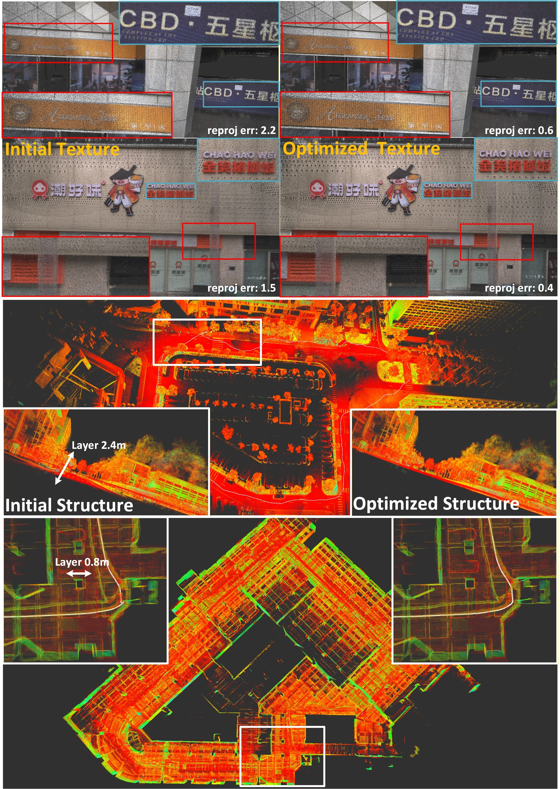

# Global-LVBA
## Global LiDAR-Visual Bundle Adjustment

**Global-LVBA** is a globally consistent **LiDAR–Visual Bundle Adjustment** system for **refinement** after LiDAR-inertial-visual odometry (e.g., FAST-LIVO2).  
If you want to push accuracy to the next level, Global-LVBA further optimizes:
- point-cloud map consistency (reducing layering/stratification artifacts).
- camera poses towards **pixel-level reprojection accuracy**.

📬 For further assistance or inquiries, please feel free to contact Chunran Zheng at zhengcr@connect.hku.hk.

<p align="center">
  
  <br/>
  <span style="color:#a0a0a0; font-size:13px;">
    This figure shows qualitative comparisons before and after Global-LVBA refinement from both texture and geometric-structure perspectives. The initial poses are provided by FAST-LIVO2.
  </span>
</p>

## 1. Prerequisites
- Python 3.8
- Ceres Solver 2.1.0
- Eigen 3.3.7
- OpenCV 4.2.0

## 2. Build

```bash
cd catkin_ws/src/Global-LVBA
git submodule update --init --recursive
cd SiftGPU && mkdir build && cd build && cmake .. && make
cd catkin_ws && catkin_make
```
## 3. Dataset preparation 
    Global-LVBA/
    └── dataset/
        └── your_sequence_name/
            ├── all_image/
            │   ├── 1661398632.022152.png     # image named by timestamp
            │   ├── 1661398632.121881.png
            │   ├── ...
            │   └── image_poses.txt           # camera poses (timestamp-aligned)
            ├── all_pcd_body/
            │   ├── 1661398632.022152.pcd     # point cloud named by timestamp
            │   ├── 1661398632.121881.pcd
            │   ├── ...
            │   └── lidar_poses.txt           # LiDAR poses (timestamp-aligned)
            ├── colmap/
            │   ├── match.db                  # feature matching database
            │   └── sparse/                   # optional: COLMAP output for 3DGS
            │       └── 0/
            │           ├── images.txt
            │           └── points3D.txt
            ├── depth/                        # optional: generated depth maps
            └── reproj/                       # optional: reprojection error logs

## 4. Dataset download

The **LVBA-Dataset** ([Google Drive](https://drive.google.com/drive/folders/19fYG4z666hcxyP6StVXs-ZOI2cbHsU5J?usp=drive_link)) is generated from the raw rosbag in **FAST-LIVO2-Dataset** ([Google Drive](https://drive.google.com/drive/folders/1bf5LQ8iSxw-fD8BObZmouw7lRxNacfrA?usp=drive_link)).

💡 **Note:** To prepare your own data with FAST-LIVO2, set `pcd_save_en: false`, `type: 1`, and `img_save_en: true` in the FAST-LIVO2 config to directly generate the required files for Global-LVBA.

## 5. Run our examples
Download the example data from LVBA-Dataset.
```bash
roslaunch Global-LVBA lvba.launch
```

💡 **Note:** We recommend using the `.db` file generated by **COLMAP** to obtain feature correspondences. The built-in SiftGPU extraction/matching in this repo is provided for convenience, but its matching quality is generally inferior to COLMAP.

## 6. License

The source code of this package is released under the [**MIT**](https://opensource.org/license/mit) license.
